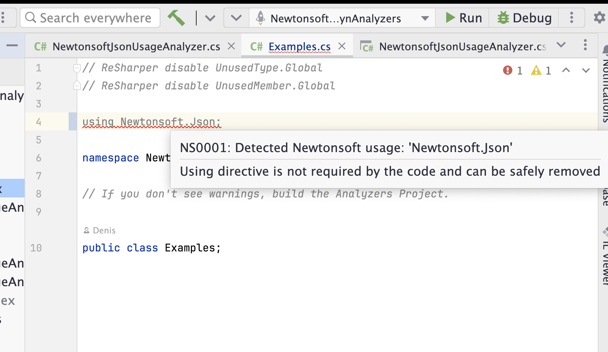

# Newtonsoft.Json Usage Analyzer

[](https://www.nuget.org/packages/NewtonsoftJsonUsageAnalyzer/)

A roslyn analyzer, which allows to detect and fail builds, which use `Newtonsoft.Json` library.

## Motivation

`Newtonsoft.Json` is a great library, and there is no any problems to use it. 
However, in some cases, people might to decide to use [System.Text.Json](https://learn.microsoft.com/en-us/dotnet/api/system.text.json?view=net-8.0) instead of.
In these cases, it is needed to have some way to detect usage of `Newtonsoft.Json` and prevent it, during migration.

## How to use

In a nutshell, you have 3 ways, how to use it:

1. You can use a nuget package with this analyzer:
```
dotnet add package NewtonsoftJsonUsageAnalyzer --version 0.2.0
```
2. You can attach this analyzer per specific project(s) (e.g., [NewtonsoftJsonUsageAnalyzer.Sample.csproj](https://github.com/Hixon10/NewtonsoftJsonUsageAnalyzer/blob/main/NewtonsoftJsonUsageAnalyzer/NewtonsoftJsonUsageAnalyzer.Sample/NewtonsoftJsonUsageAnalyzer.Sample.csproj)):
```
    <ItemGroup>
        <ProjectReference Include="..\NewtonsoftJsonUsageAnalyzer\NewtonsoftJsonUsageAnalyzer.csproj"
                          OutputItemType="Analyzer" ReferenceOutputAssembly="false"/>
    </ItemGroup>
```
3. You can attach this analyzer [globally](https://www.meziantou.net/referencing-an-analyzer-from-a-project.htm) via `Directory.Build.props`:
```
<Project>
  <ItemGroup>
    <!-- Use MSBuildThisFileDirectory to make the path relative to the current file location -->
    <ProjectReference Include="$(MSBuildThisFileDirectory)\NewtonsoftJsonUsageAnalyzer\NewtonsoftJsonUsageAnalyzer.csproj"
                      PrivateAssets="all"
                      ReferenceOutputAssembly="false"
                      OutputItemType="Analyzer" />
  </ItemGroup>
</Project>
```

## Example of NS0001 



```
$ dotnet build
1>Examples.cs(4,1): Error NS0001 : Detected Newtonsoft usage: 'Newtonsoft.Json'
1>------- Finished building project: NewtonsoftJsonUsageAnalyzer.Sample. Succeeded: False. Errors: 1. Warnings: 0
Build completed in 00:00:01.838
```

## Credits
1. [https://github.com/jonathanpeppers/memory-analyzers](https://github.com/jonathanpeppers/memory-analyzers) - example, how to build Roslyn analyzers.
2. [JetBrains Rider](https://www.jetbrains.com/rider/) - really awesome predifined template for Roslyn analyzers, including samples and tests.